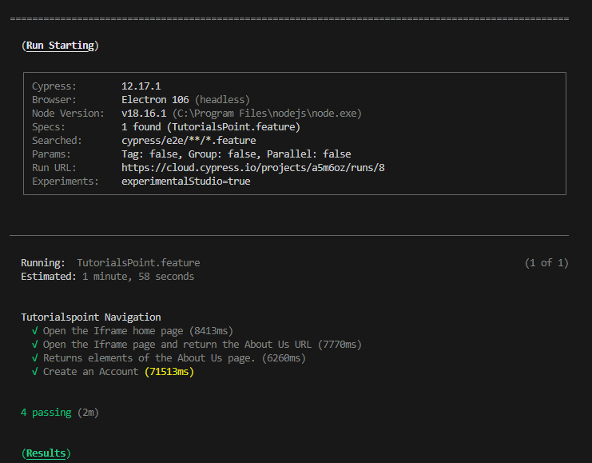

#   Patagonian-POC
 

## Assestment
### Create an interaction with a website where the URL tutorialspoint.com/html/html_iframes.htm is loaded and the program navigates into the page below “Document content goes here…“, interacts with the “About us” link, then returns the URL of the new page, a list of all URLs on the page, a list of all buttons on the page, a list of all text input fields on the page, then creates an account and logs into the site. The output should be both via console and output to the appended file.

 
## ---------

> **Note**:
 
Cypress tool was used to develop the test suite integrated with Cucumber and Gherkin.


#### You need to install

* Node
* npm


#### Instruction to run the test

Clone this repo
+ run `npm install`


Run the project directly from the Browser

+ `npx cypress open`

or run the project by console

+ `npx cypress run --spec "cypress/e2e/features/Tutorialspoint.feature" --browser chrome`


```
project  
│
└───cypress
│   │
│   └───e2e
│       │
│       └─── features (Gherkin file with test cases description)
│       │
│       └─── page-objects (POM files with models)
│       │
│       └─── Tests (Code)

```


Example of test execution




<h3> Video execution:</h3>

<!DOCTYPE html>
<html lang="en">
<head>
    <meta http-equiv="Content-Type" content="text/html; charset=utf-8" />
    <title>Deltion Live Streaming</title>
    <script language="javascript" type="text/javascript" src="../swfobject.js"></script>
</head>

<body>   
    <video id="movie" width="460" height="306" preload autoplay>
        <source src="https://github.com/magnethus/patagonian/blob/main/screenshots/TutorialsPoint.feature.mp44"  type='video/mp4; codecs="avc1.42E01E, mp4a.40.2"'> 
    </video>
</body>
</html>

 